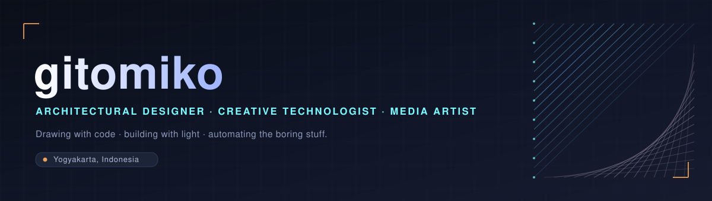

<!-- ============ BANNER ============ -->

  

<!-- ============ TYPING TAGLINE ============ -->

  

  
  &nbsp;
  
  &nbsp;
  

---

## ✦ Hello, I'm Gito

I live in the seam between three disciplines that most people keep in separate rooms:
the **architect** who thinks in space and structure, the **technologist** who teaches
computers to draw, and the **media artist** who only trusts an idea once it glows.

Most of what I build starts the same way — a repetitive, slightly tedious task that I
decide to never do by hand again. Some of those experiments become tools. A few become
art. The rest become commits nobody will ever read, and that's perfectly fine.

> *Plans, scripts, and renders are just different file formats for the same idea.*

- 🏛️ **By training** — architectural designer, fluent in plans, sections, and the quiet logic of buildings.
- 🧪 **By instinct** — a tinkerer who reaches for a script before a manual workaround.
- 🎨 **By temperament** — a media artist chasing light, motion, and the occasional happy accident.
- 🌱 **Right now** — exploring parametric workflows, generative visuals, and tiny automations that buy back time.

---

## ✦ Things I've Made

  
  

  
  

  🧠 Also quietly tinkering on <b>SecondBrain</b>, <b>undervolt-tools</b>, and <b>Podomoro</b> — small tools that make the day run smoother.

---

## ✦ The Toolkit

<table align="center">
  <tr>
    <td><b>🏗️ CAD / BIM</b></td>
    <td>
      
      
      
      
    </td>
  </tr>
  <tr>
    <td><b>🎨 Creative</b></td>
    <td>
      
      
      
      
      
    </td>
  </tr>
  <tr>
    <td><b>💻 Code</b></td>
    <td>
      
      
      
      
    </td>
  </tr>
  <tr>
    <td><b>🖌️ Design</b></td>
    <td>
      
      
      
      
      
    </td>
  </tr>
</table>

---

## ✦ By the Numbers

  
  

  

---

  <i>✨ Building things, solving problems, and learning every day — usually all at once. ✨</i>

